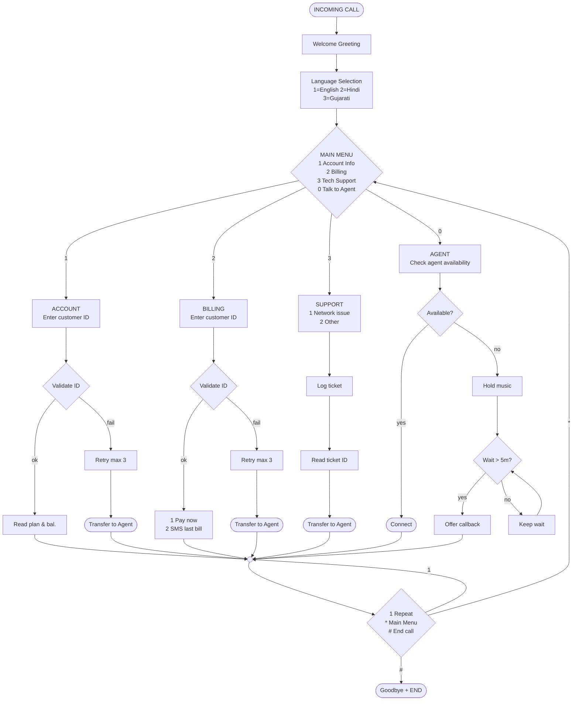

# IVRS Call Flow Map Better View as FlowChart

```mermaid
flowchart TD
    In([INCOMING CALL]) --> Welcome[Welcome Greeting]
    Welcome --> Lang[Language Selection<br>1=English  2=Hindi<br>3=Gujarati]
    Lang --> MainMenu
    
    MainMenu{MAIN MENU<br>1 Account Info<br>2 Billing<br>3 Tech Support<br>0 Talk to Agent}
    
    MainMenu -- 1 --> Acc[ACCOUNT<br>Enter customer ID]
    MainMenu -- 2 --> Bill[BILLING<br>Enter customer ID]
    MainMenu -- 3 --> Tech[SUPPORT<br>1 Network issue<br>2 Other]
    MainMenu -- 0 --> Agent[AGENT<br>Check agent availability]
    
    Acc --> ValAcc{Validate ID}
    ValAcc -- ok --> ReadPlan[Read plan & bal.]
    ValAcc -- fail --> RetryAcc[Retry max 3]
    RetryAcc --> AgentAcc([Transfer to Agent])
    
    Bill --> ValBill{Validate ID}
    ValBill -- ok --> PayBill[1 Pay now<br>2 SMS last bill]
    ValBill -- fail --> RetryBill[Retry max 3]
    RetryBill --> AgentBill([Transfer to Agent])
    
    Tech --> LogTicket[Log ticket]
    LogTicket --> ReadTicket[Read ticket ID]
    ReadTicket --> AgentTech([Transfer to Agent])
    
    Agent --> Avail{Available?}
    Avail -- yes --> Connect([Connect])
    Avail -- no --> Hold[Hold music]
    Hold --> Wait5{Wait > 5m?}
    Wait5 -- yes --> Callback[Offer callback]
    Wait5 -- no --> KeepWait[Keep wait]
    KeepWait --> Wait5
    
    ReadPlan --> Collector
    AgentAcc --> Collector
    PayBill --> Collector
    AgentBill --> Collector
    AgentTech --> Collector
    Connect --> Collector
    Callback --> Collector
    
    Collector(( )) --> RepEnd{1 Repeat<br>* Main Menu<br># End call}
    RepEnd -- * --> MainMenu
    RepEnd -- 1 --> Collector
    RepEnd -- # --> End([Goodbye + END])
```

